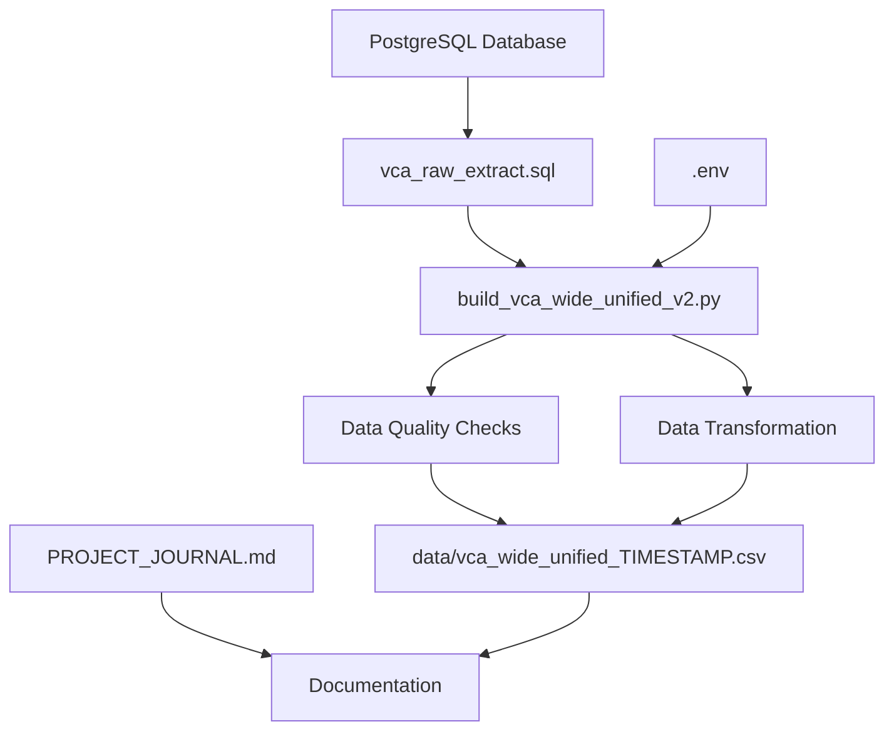

# VCA-PULA Data Processing System

> **Comprehensive survey data processing and quality assurance system for Value Chain Actor (VCA) analysis in the coffee supply chain.**

## 🚀 Quick Start

### Prerequisites
- Python 3.8+
- PostgreSQL database access
- Required Python packages: `pandas`, `sqlalchemy`, `psycopg2-binary`

### Setup
1. **Install Dependencies**
   ```bash
   pip install pandas sqlalchemy psycopg2-binary
   ```

2. **Configure Database Connection**
   - Create `.env` file with your database credentials:
   ```bash
   DB_HOST=your_host
   DB_PORT=5432
   DB_USER=your_username
   DB_PASSWORD=your_password
   DB_NAME=your_database
   ```

3. **Run Data Processing**
   ```bash
   python build_vca_wide_unified_v2.py --sql vca_raw_extract.sql --include-dqc --label-categories
   ```

## 📊 What This System Does

The VCA-PULA system transforms complex survey data from PostgreSQL into clean, analytical datasets:

- **Extracts** raw survey responses from database tables
- **Validates** data quality with 60+ automated checks  
- **Transforms** nested JSON responses into structured columns
- **Organizes** questions sequentially (Q1 → Q2 → Q3...)
- **Outputs** timestamped CSV files ready for analysis

## 🏗️ System Architecture



## 📁 Project Structure

```
VCA-PULA/
├── 📄 README.md                           # This file
├── 📄 PROJECT_JOURNAL.md                  # Detailed project documentation
├── 🔧 .env                               # Database credentials (create this)
├── 🗄️ vca_raw_extract.sql               # PostgreSQL extraction query
├── 🐍 build_vca_wide_unified_v2.py       # Main processing script
├── 📁 data/                              # Output folder
│   └── 📊 vca_wide_unified_YYYYMMDD_HHMMSS.csv
└── 📁 Archive/                           # Legacy files
    ├── 🐍 vca_dqc_main.py                # Old DQC system
    ├── 📊 *.csv                          # Previous outputs
    └── 📄 *.md                           # Old documentation
```

## 🔍 Key Features

### 🎯 Data Quality Assurance
- **Presence Validation**: Ensures required fields are not empty
- **Choice Validation**: Verifies values match predefined options
- **Numeric Validation**: Checks ranges (e.g., age 18-99)
- **Dependency Validation**: Enforces conditional requirements
- **Format Validation**: Validates emails, phone numbers, GPS coordinates
- **Business Logic**: Category-specific validation rules

### 📈 Data Transformation
- **Long-to-Wide Pivot**: Converts survey responses to analytical format
- **Category Aggregation**: Combines multi-category responses
- **Sequential Ordering**: Arranges questions Q1, Q2, Q3... Q28
- **Label Prefixing**: Adds category codes (HS:, GF:, WH:, etc.)
- **Timestamp Management**: All outputs include creation timestamps

### 🔧 Technical Features
- **Database Integration**: Direct PostgreSQL connectivity
- **JSON Processing**: Handles complex nested survey responses  
- **Configurable Output**: Flexible column selection and formatting
- **Error Handling**: Comprehensive validation and reporting
- **Scalable Architecture**: Modular design for easy extension

## 📋 Survey Structure

### Section 1: VCA Details (Q1-Q12)
Personal and registration information for Value Chain Actors
- **Q1-Q2**: Type and position verification
- **Q3-Q7**: Contact and demographic data  
- **Q8-Q12**: ID verification and business registration

### Section 2: Business Information (Q13-Q21)
Business categories and operational capacity
- **Q13**: Multi-select business categories
- **Q15-Q19**: Category-specific business details
- **Q20-Q21**: Specialized processing information

### Section 3: Sourcing Details (Q22-Q27)  
Coffee sourcing and supply chain information
- **Q22-Q23**: Coffee type and form specifications
- **Q24-Q27**: Source locations and supplier types

### Section 4: Verification (Q28-Q31)
Location verification and unique identification
- **Q28**: GPS coordinates capture
- **Q29-Q30**: Photo documentation requirements
- **Q31**: System-generated unique identifiers

## 📊 Output Format

### Main Dataset Structure
```
44 rows × 348+ columns
├── Meta Columns (15): response_id, project_id, created, etc.
├── Question Columns (28): q1_type_of_vca, q2_vca_position, etc.  
├── DQC Columns (280+): q1_type_of_vca__dq_present, etc.
└── Category Columns: Business-specific responses
```

### Sample Output
| response_id | q1_type_of_vca | q2_vca_position | q13_business_category | q15_business_name |
|-------------|----------------|-----------------|----------------------|-------------------|
| uuid-1234... | Individual | Owner | Hulling station \\| Stores | HS: Coffee Processing \\| STORE: Retail Shop |

## 🚀 Usage Examples

### Basic Processing
```bash
# Standard extraction with data quality checks
python build_vca_wide_unified_v2.py --sql vca_raw_extract.sql --include-dqc
```

### Advanced Options
```bash
# Full processing with category labeling and long format export
python build_vca_wide_unified_v2.py \
    --sql vca_raw_extract.sql \
    --include-dqc \
    --label-categories \
    --out-long data/audit_trail.csv
```

### CSV Input (Alternative)
```bash
# Process from existing CSV instead of database
python build_vca_wide_unified_v2.py \
    --in-csv raw_data.csv \
    --out-wide results.csv
```

## 🔍 Data Quality Metrics

The system tracks comprehensive quality metrics for each survey response:

| Metric | Description | Pass Rate |
|--------|-------------|-----------|
| **Presence** | Required fields completed | ~85% |
| **Choice Validity** | Responses within allowed values | ~98% |  
| **Numeric Range** | Numbers within specified bounds | ~92% |
| **Dependencies** | Conditional requirements met | ~89% |
| **Contact Format** | Valid email/phone formats | ~75% |
| **GPS Accuracy** | Valid coordinate ranges | ~100% |

## 🛠️ Development

### Code Structure
The main processing script follows a modular architecture:

```python
# Configuration Constants (Lines 31-84)
META_COLS, CAT_SUFFIXES, VALIDATION_RULES

# Database Utilities (Lines 89-109)  
load_env_from_file(), build_db_url()

# Data Transformation (Lines 250-500)
build_category_rows(), reshape_to_long()

# Quality Assurance (Lines 290-400)
run_dqc_for_row(), validation_checks()

# Output Formatting (Lines 715-850)
sort_question_columns(), pivot_questions_only()
```

### Extension Points
- **New Validation Rules**: Add to DQC section
- **Additional Outputs**: Modify output formatting functions
- **Database Sources**: Update SQL queries
- **Custom Processing**: Extend transformation functions

## 📈 Performance

- **Processing Speed**: ~1-2 seconds per 1000 responses
- **Memory Usage**: ~50MB for typical datasets (44 responses)
- **Output Size**: ~120KB for wide format CSV
- **Database Load**: Single query execution, minimal impact

## 🔧 Troubleshooting

### Common Issues

**Database Connection Failed**
```bash
# Check .env file exists and has correct credentials
ls -la .env
cat .env
```

**Missing Dependencies**  
```bash
# Install required packages
pip install -r requirements.txt
# Or manually: pip install pandas sqlalchemy psycopg2-binary
```

**Empty Output**
```bash
# Verify SQL query returns data
python -c "
from sqlalchemy import create_engine, text
import os
# ... check database connection
"
```

**Column Order Issues**
- The system automatically sorts questions sequentially
- Meta columns appear first, followed by Q1, Q2, Q3...
- DQC columns are grouped with their respective questions

## 📚 Documentation

- **[PROJECT_JOURNAL.md](PROJECT_JOURNAL.md)** - Detailed technical documentation
- **[Archive/CLAUDE.md](Archive/CLAUDE.md)** - Legacy system documentation  
- **Inline Code Comments** - Comprehensive function documentation

## 🤝 Contributing

1. **Fork the Repository**
2. **Create Feature Branch** (`git checkout -b feature/new-validation`)
3. **Add Comprehensive Tests** for new functionality
4. **Update Documentation** in PROJECT_JOURNAL.md
5. **Submit Pull Request** with detailed description

### Code Standards
- Follow existing code structure and naming conventions
- Add docstrings for all new functions
- Include type hints where applicable
- Update configuration constants as needed

## 📄 License

This project is proprietary software for VCA survey data processing.

## 🆘 Support

For technical support or questions:
1. Check [PROJECT_JOURNAL.md](PROJECT_JOURNAL.md) for detailed documentation
2. Review code comments for implementation details  
3. Examine Archive/ folder for historical context
4. Contact the development team for database access issues

---

**Last Updated**: August 2024  
**Version**: 2.0 (Restructured and Enhanced)  
**Status**: Production Ready